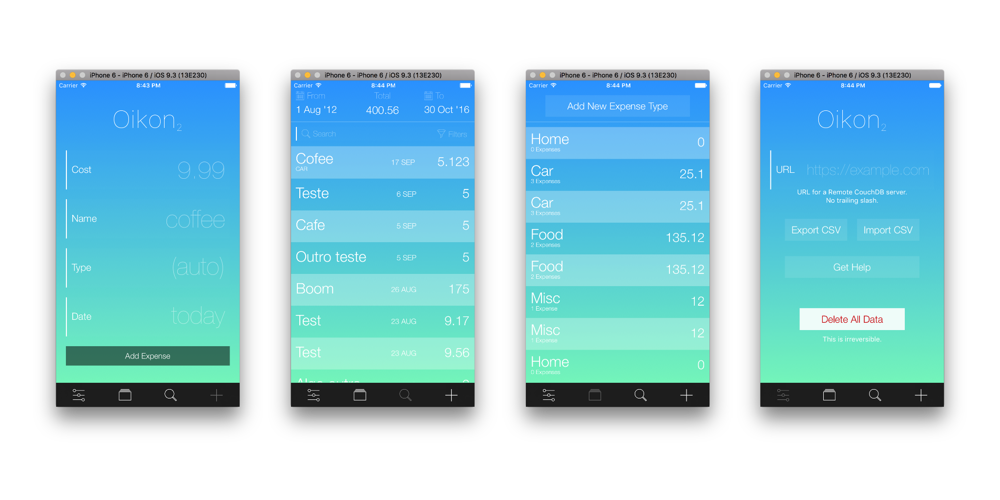

# Oikon 2

## Requirements

`nvm`, `npm`, `rnpm`, and `react-native`.

`$ nvm install 6 && nvm alias default 6 && nvm use default`

## Dependencies

`$ npm install && rnpm link`

## Development

`$ react-native run-ios`

In simulator, press `Cmd+R` to reload, `Cmd+D` or shake for dev menu.

## Current State

Check [TODO.md](TODO.md) for a list of specific tasks.

Most of this is working and looking fine, it's missing mostly copy+pasting, adapting, and refactoring the components, but I got blocked on the implementation of some UX.

Most specifically, the thing that blocked me was not being able to easily add the `CommonTopKeyboardView` when there was a `Modal` already visible.

In the end, I loved learning about React Native and the different paradigms. I'll probably come back to this later, but right now I'm focusing on other things in my life.

## Screenshots

- [Add Expense](screenshots/add-expense.png)

- [Add Expense with Keyboard](screenshots/add-expense-keyboard.png)

- [Added Expense Successfully](screenshots/add-expense-success.png)

- [View Expenses](screenshots/view-expenses.png)

- [View Expenses - Date Filter](screenshots/view-expenses-date-filter.png)

- [View Expenses - Search Filter](screenshots/view-expenses-search.png)

- [View Expenses - Filter](screenshots/view-expenses-filter.png)

- [Edit Expense](screenshots/view-expenses-edit.png)

- [View Expense Types](screenshots/view-expense-types.png)

- [Settings](screenshots/settings.png)
